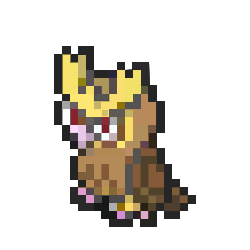

<div align="center">
  <h1>
    
    Noctowl
  </h1>
  <p>Monitoramento Inteligente de Recursos de Servidor</p>
  
  <p>
    
    
    
  </p>
</div>

##  Visão Geral

O Noctowl é uma solução completa para monitoramento de recursos de servidor, oferecendo:

- Monitoramento em tempo real de CPU, memória e disco
- Sistema de alertas multi-plataforma
- Logging detalhado para análise histórica

##  Funcionalidades Principais

**Monitoramento de Recursos**  
- Verificação precisa do uso de CPU (com `mpstat` ou `top`)  
- Análise de memória considerando cache/buffers  
- Checagem inteligente de espaço em disco  

**Sistema de Alertas**  
- Notificações por e-mail, Slack e Telegram  
- Limites personalizáveis para cada recurso  
- Mensagens claras com informações detalhadas  

**Logging Avançado**  
- Registro em arquivo com timestamps  
- Saída colorida para terminal  
- Níveis de log configuráveis  

##  Pré-requisitos

- Bash 4.0+
- Utilitários básicos: `mpstat`, `free`, `df`
- Para notificações:
  - `mailx` (para e-mail)
  - `curl` (para Slack/Telegram)

##  Instalação Rápida

1. Clone o repositório:

```bash
git clone https://github.com/GirardiMatheus/Noctowl.git && cd Noctowl
```

2. Configure o ambiente:

```bash
cp .env.example .env
# Edite as variáveis conforme necessário
nano .env
````
3. Torne o script executável:

```bash
chmod +x monitor.sh
```

## Como Usar

**Execução manual:**

```bash
./monitor.sh
```

**Agendamento no cron (a cada 5 minutos):**

```bash
*/5 * * * * /caminho/para/Noctowl/monitor.sh
```
**Modo debug:**
```bash
DEBUG=true ./noctowl-monitor.sh
```


## Estrutura do Projeto

```bash
Noctowl/
├── monitor.sh           # Script principal
├── .env.example         # Template de configuração
├── assets/
│   └── noctowl.svg      # Ícone do projeto
└── README.md            # Esta documentação
```

## Melhores Práticas

1. Configuração de alertas:

```bash
# No arquivo .env
NOCTOWL_ALERT_CPU=90       # Alerta ao atingir 90% de CPU
NOCTOWL_ALERT_MEM=85       # Alerta ao atingir 85% de memória
NOCTOWL_ALERT_DISK=80      # Alerta ao atingir 80% de disco
```

2. Rotação de logs:

```bash
# Adicione ao /etc/logrotate.d/noctowl
/var/log/noctowl.log {
    weekly
    rotate 4
    compress
    missingok
    notifempty
}
```
## Contribuição

1. Fork o projeto
2. Crie sua branch (git checkout -b feature/nova-funcionalidade)
3. Commit suas mudanças (git commit -am 'Add nova funcionalidade')
4. Push para a branch (git push origin feature/nova-funcionalidade)
5. Abra um Pull Request